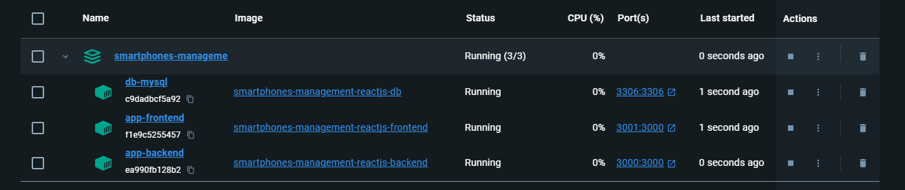
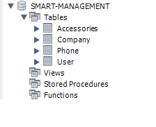
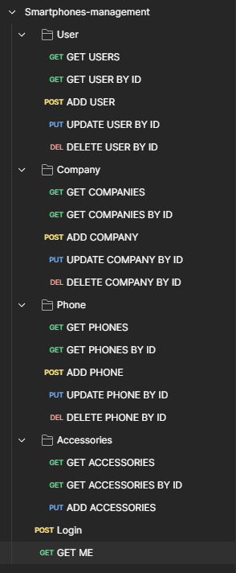
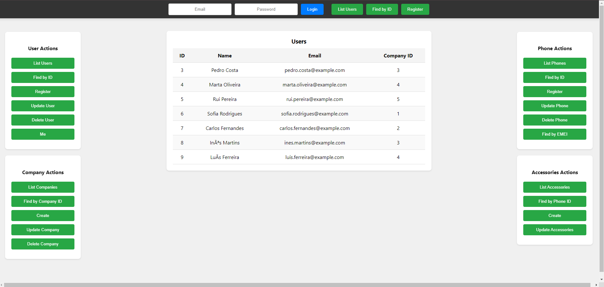

# Avaliação Contínua, Momento 2 - 2023/24

O presente repositório serve para mostrar o projeto designado M2, desenvolvido para a disciplina de Desenvolvimento WEB 2 do 2º ano da Licenciatura de Informática lecionada na Universidade da Maia.

O presente trabalho foi desenvolvido pelo grupo G23 constituído pelos seguintes elementos:

* [André Gomes](https://github.com/aasfgomes)
* [Gonçalo Sousa](https://github.com/MrcWithAMouth)

## Smartphone Management

O projeto "Smartphone Management" é uma aplicação web para a gestão de telemóveis e acessórios. Utiliza React no frontend com React Router DOM, Axios, e React Toastify para navegação, requisições HTTP, e notificações. O backend, previsto para ser desenvolvido em Express.js, gerencia a API e a autenticação. A aplicação é containerizada com Docker e Docker Compose, facilitando o desenvolvimento e deploy. Esta aplicação permitirá registar, atualizar, procurar e remover informações sobre utilizadores, empresas, telemóveis e acessórios. A escolha destas tecnologias visa criar uma solução robusta e escalável para gerir informações de dispositivos móveis de forma eficiente e segura.

## Organização do repositório

* [Source code](https://github.com/INF23DW2G23/REPORT_DW2_M2)
* [Imagens](https://github.com/INF23DW2G23/REPORT_DW2_M2/data/images)

## Galeria

### Docker

### Base de Dados

### Postman

### Interface

### Tecnologias

#### Linguagens de Programação:

* JavaScript (React)
* CSS

#### Ferramentas de Desenvolvimento:

* Docker

#### Outras Tecnologias

* HTML
* MySQL

### Frameworks e Bibliotecas

#### Frontend:

* React
* React Router DOM
* Axios
* React Toastify
* React Scripts
* Testing Library

#### Backend:

* Express

#### Docker:

* Docker Compose
* Dockerfile

#### Configuração e Scripts

* Eslint
* Browserslist

### Apresentação do projeto

* Capitulo 1: [Descrição do projeto](files/File1.md)
* Capitulo 2: [Recursos](files/File2.md)
* Capitulo 3: [Desenvolvimento](files/File3.md)

### Dockerhub

[DockerHub](https://hub.docker.com/repositories/inf23dw2g23)
